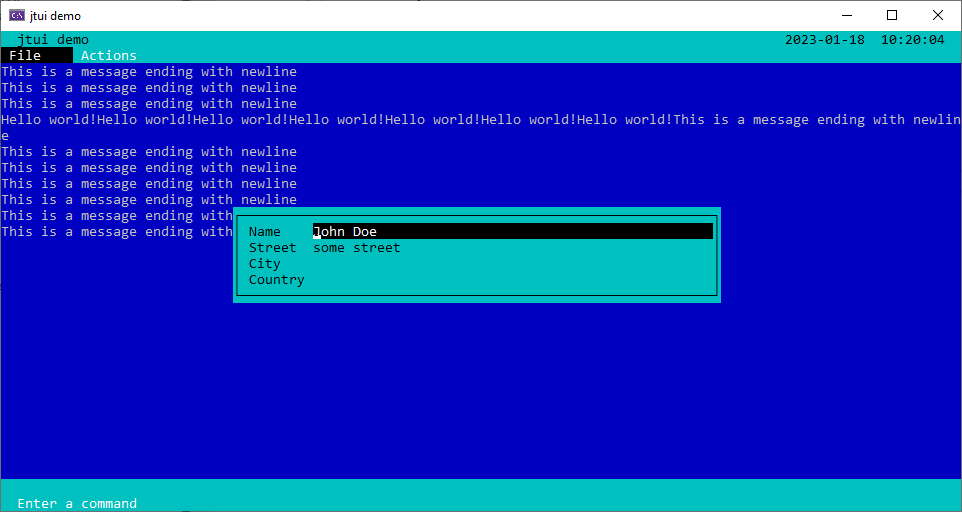
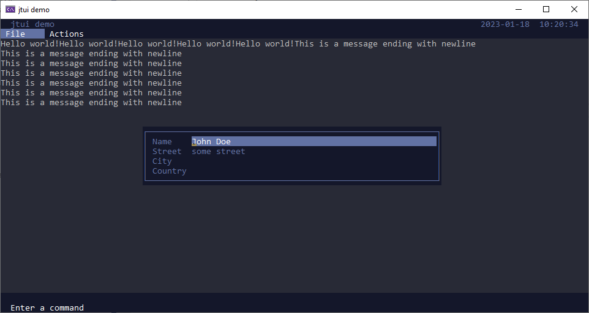
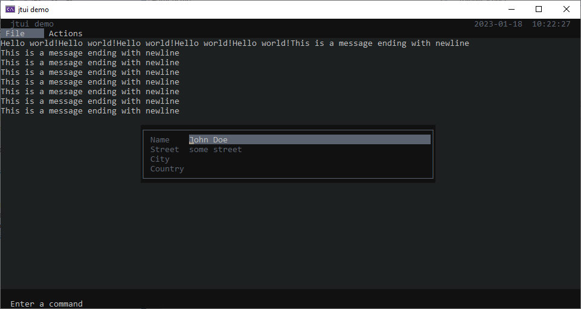
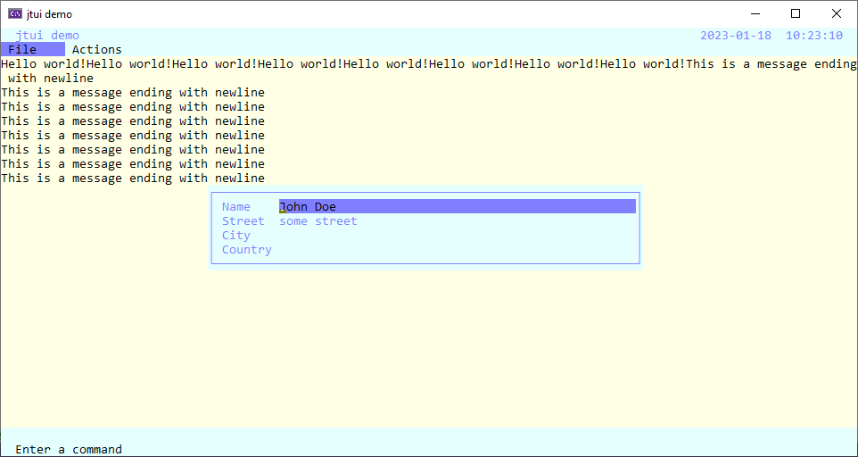

# jtui
Jan's textual user interface.

This is a more modern C++ remake of the [tui](https://github.com/janm31415/PDCurses/blob/master/demos/tui.h) by P.J. Kunst that is delivered with the demo code of PDCurses.

The purpose of this library is not to be a complete user interface, but rather allow fast prototyping of experimental code.

## Building
Use `CMake` to build the code for Windows, MacOs, or Linux. Since this repository uses submodules you first have to call

    git submodule update --init
    
before you run `CMake`.

In `CMake` it is important that you set the variable

    PDCURSES_TARGET
    
to the correct value. There are three choices:

  1. wincon: Windows only, integrates `jtui` in the Windows Console.
  2. sdl2: Cross platform solution that uses the library `SDL2`.
  3. x11: MacOs and Linux only. Uses X11.
  
On MacOs, you might need to install X11. This can be done with the command

    brew install --cask xquartz  
  
## Screenshots

Default color scheme

Blue color scheme

Dark blue color scheme

Dark color scheme

Acme color scheme

  
