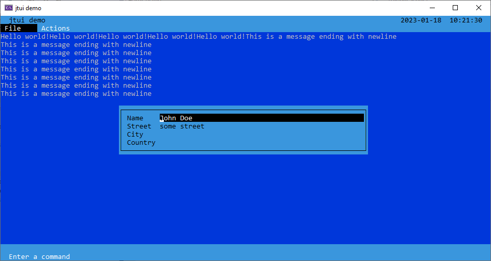

# jtui
Jan's textual user interface.

This is a more modern remake of the tui by P.J. Kunst that is delivered with the demo code of PDCurses.

## Building
Use CMake to build the code for Windows, MacOs, or Linux. Since this repository uses submodule you have to first call

    git submodule update --init
    
before you run CMake.

In CMake it is important that you set the variable

    PDCURSES_TARGET
    
to the correct value. There are three choices:

  1. wincon: Windows only, integrates `jtui` in the Windows Console.
  2. sdl2: Cross platform solution that uses the library `SDL2`.
  3. x11: MacOs and Linux only. Uses X11.
  
## Screenshots

There are some color schemes available. 

  
